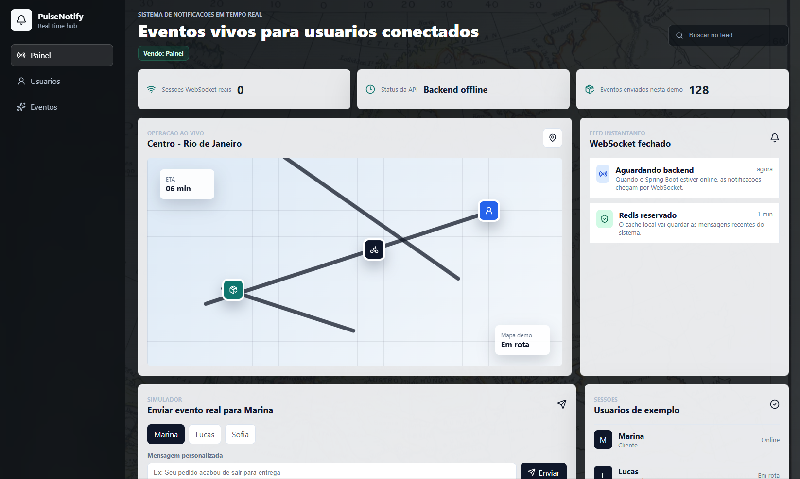
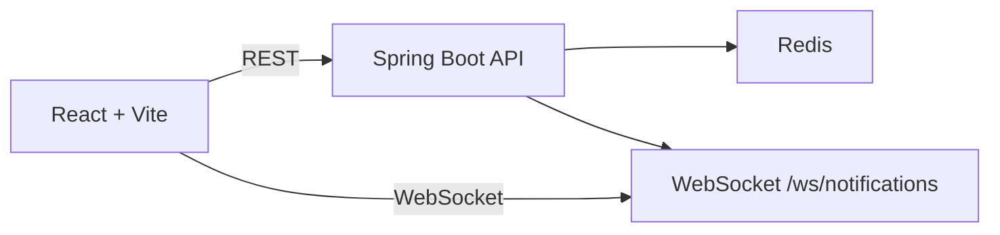

# PulseNotify

Sistema de notificacoes em tempo real com backend em Java, Spring Boot, WebSocket, Redis e frontend em React.



## Sobre o projeto

O PulseNotify simula uma central de notificacoes em tempo real. A aplicacao permite enviar notificacoes para usuarios conectados, receber eventos instantaneamente via WebSocket, consultar mensagens recentes e acompanhar o status da API.

Esse projeto foi desenvolvido como peca de portfolio para demonstrar integracao entre frontend, backend, comunicacao em tempo real e cache com Redis.

## Funcionalidades

- Envio de notificacoes por API REST.
- Entrega em tempo real para usuarios conectados via WebSocket.
- Historico de notificacoes recentes armazenado no Redis.
- Painel em React para simular usuarios, eventos e mensagens customizadas.
- Endpoint de status com quantidade de usuarios online.
- Configuracao para execucao local e deploy do backend.

## Tecnologias

- Java 17
- Spring Boot 3
- Spring WebSocket
- Spring Data Redis
- React
- Vite
- Docker Compose
- Render
- Vercel

## Arquitetura



## Como rodar localmente

### Pre-requisitos

- Java 17+
- Maven
- Node.js 20+
- Docker

### 1. Suba o Redis

```bash
docker compose up -d
```

O Redis ficara disponivel em `localhost:6379`.

### 2. Rode o backend

```bash
cd backend
mvn spring-boot:run
```

Por padrao, a API sobe em:

```text
http://localhost:8080
```

### 3. Configure e rode o frontend

```bash
cd frontend
npm install
npm run dev
```

O frontend usa as variaveis do arquivo `frontend/.env.example`:

```env
VITE_API_URL=http://localhost:8080
VITE_WS_URL=ws://localhost:8080/ws/notifications
```

## Endpoints principais

### Status da API

```http
GET /api/notifications/status
```

Resposta esperada:

```json
{
  "api": "running",
  "websocket": "/ws/notifications",
  "onlineUsers": 1
}
```

### Listar notificacoes recentes

```http
GET /api/notifications/recent
```

### Criar uma notificacao

```http
POST /api/notifications
Content-Type: application/json
```

```json
{
  "targetUser": "Marina",
  "title": "Nova mensagem recebida",
  "text": "O operador respondeu sua solicitacao em tempo real.",
  "tone": "yellow",
  "type": "message"
}
```

### Conectar via WebSocket

```text
ws://localhost:8080/ws/notifications?user=Marina
```

Quando uma notificacao e enviada para o usuario conectado, o WebSocket recebe um evento com este formato:

```json
{
  "event": "notification",
  "payload": {
    "id": "uuid",
    "targetUser": "marina",
    "title": "Nova mensagem recebida",
    "text": "O operador respondeu sua solicitacao em tempo real.",
    "tone": "yellow",
    "type": "message",
    "createdAt": "2026-04-29T00:00:00Z"
  }
}
```

## Estrutura do projeto

```text
.
|-- backend/              # API Spring Boot
|-- frontend/             # Interface React + Vite
|-- docker-compose.yml    # Redis local
|-- render.yaml           # Configuracao do backend no Render
`-- pulseNotify.png       # Preview da aplicacao
```

## Deploy

- Backend: configurado para Render via `render.yaml`.
- Frontend: preparado para Vercel, usando as variaveis `VITE_API_URL` e `VITE_WS_URL`.

## Melhorias futuras

- Autenticacao de usuarios.
- Persistencia em banco relacional.
- Testes automatizados no backend e frontend.
- Filtros avancados para notificacoes.
- Confirmacao de leitura e contagem de nao lidas.
